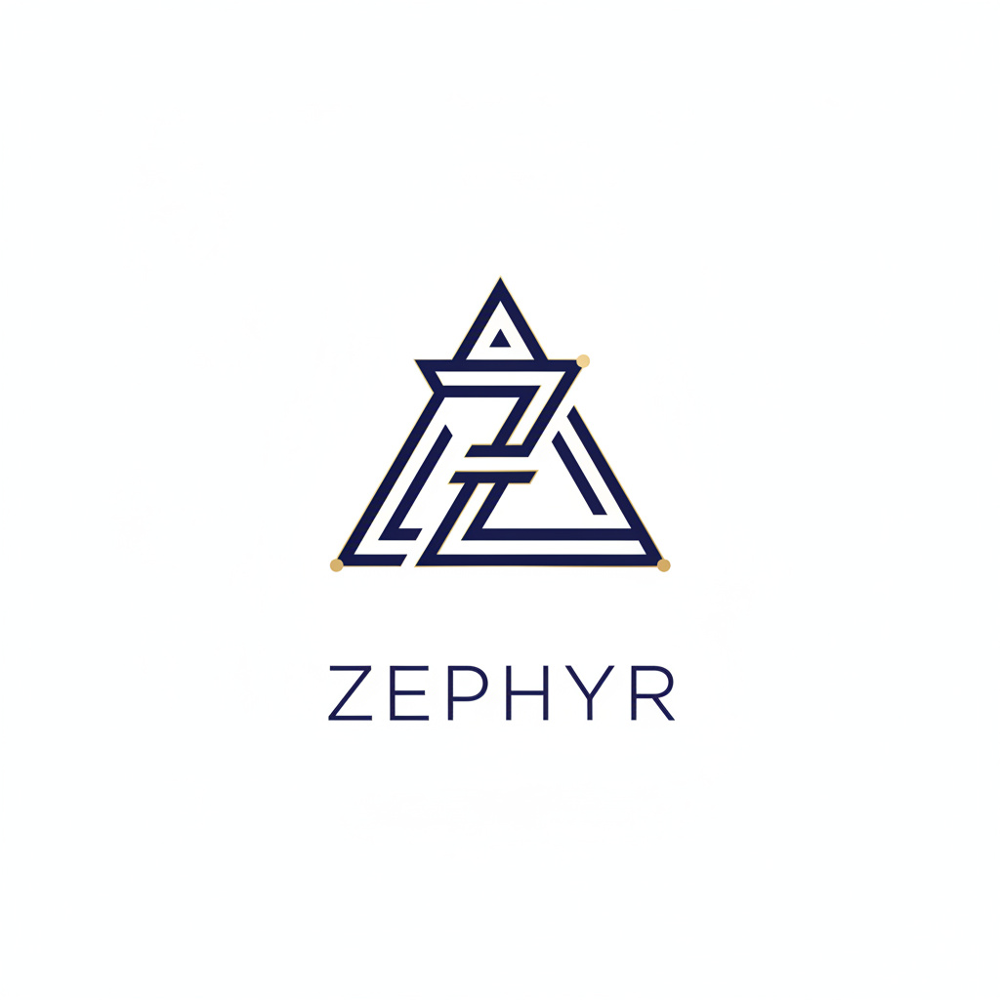

# 💎 ZENITH | High-Fidelity E-Commerce Collective

<p align="center">
  
</p>

<p align="center">
  <strong>Experience luxury at its peak.</strong><br />
  A state-of-the-art boutique ecosystem blending futuristic glassmorphism with enterprise-grade security.
</p>

<p align="center">
  
  
  
  
  
</p>

<p align="center">
  
  
  
  
</p>

---

## 📸 Interface Preview

<p align="center">
  
  <br />
  <em>The Zenith Landing Interface featuring atmospheric auras and geometric depth.</em>
</p>

<div align="center">
  
  
  
  
  
  
  
  
  
  
  
  
  

  
</div>

---

## ⚡ Technical Core

### 🎨 The Interface (Next.js)
- **Framework:** Next.js 15 (App Router) with TypeScript.
- **Visuals:** Tailwind CSS v4 utilizing **Glassmorphism** and High-Fidelity mesh gradients.
- **Motion:** Framer Motion for scroll-reveal entrance animations and micro-interactions.
- **Security:** Axios instance with **JWT Interceptors** for stateless session management.

### ⚙️ The Engine (Spring Boot)
- **Architecture:** Layered Architecture (Controller, Service, Repository, Entity).
- **Security:** Spring Security 6 with **OAuth2** (Google/GitHub) and local **BCrypt** hashing.
- **Persistence:** Hibernate + Spring Data JPA with MySQL.
- **Mail:** Integrated Java Mail Sender for automated **ZENITH** branded notifications.
- **Documentation:** Swagger UI (OpenAPI 3.0) for interactive API exploration.

---

## ✨ Key Capabilities

- **🛡️ Multi-Layer Auth:** Secure login via Google, GitHub, or local credentials.
- **🛍️ Dynamic Collection Modules:** Separate high-performance pages for Men, Women, and Accessories.
- **🛒 Persistent Bag:** Database-synced shopping cart with real-time quantity updates.
- **📧 Automated Workflow:** Instant branded email alerts upon registration and order placement.
- **✨ Aura Aesthetics:** Moving background design elements with grain texture for a tactile feel.

---

## 📂 Repository Structure

```text
BACKEND

src/main/java/com/example/ecommerce/demo/
├── config/                  # Global Settings
│   ├── CloudinaryConfig.java    # Image upload setup
│   ├── SecurityConfig.java      # JWT & Path permissions
│   └── WebConfig.java           # CORS (The bridge to Next.js)
├── Controller/              # API Endpoints (The Entry Points)
│   ├── AuthController.java      # Login/Register logic
│   ├── CartController.java      # Shopping bag logic
│   ├── ChatController.java      # AI Stylist logic
│   ├── OrderController.java     # Checkout & History logic
│   └── ProductController.java   # Catalog & Category logic
├── dto/                     # Data Transfer Objects (Clean JSON packages)
│   ├── LoginRequest.java
│   ├── RegisterRequest.java
│   └── ProductDTO.java
├── entity/                  # Hibernate Models (MySQL Tables)
│   ├── User.java                # User & Roles
│   ├── Product.java             # Product & Categories
│   ├── Order.java               # Order headers
│   ├── OrderItem.java           # Items inside an order
│   └── CartItem.java            # Temporary cart storage
├── repository/              # Data Access (JPA Queries)
│   ├── UserRepository.java
│   ├── ProductRepository.java   # Category filtering logic
│   └── OrderRepository.java
├── security/                # The Security Shield
│   ├── JwtFilter.java           # Request interceptor
│   ├── JwtUtils.java            # Token generation
│   └── OAuthSuccessHandler.java # Google/GitHub bridge
├── Service/                 # Business Logic (The Brain)
│   ├── ImageService.java        # Cloudinary logic
│   ├── OrderService.java        # Email & Transaction logic
│   └── ProductService.java
└── EcommerceApplication.java # The Main Switch
src/main/resources/
└── application.yml          # Secret Keys (Google, MySQL, Mail)


FRONTEND


src/
├── app/                     # The Routing System (Pages)
│   ├── (auth)/              # Grouped Auth routes
│   │   ├── login/page.tsx       # ZENITH Luxury Login
│   │   ├── register/page.tsx    # Identity Registration
│   │   └── callback/page.tsx    # OAuth Token Handler
│   ├── category/[slug]/     # Dynamic Category Pages (Men/Women/Acc)
│   ├── product/[id]/        # High-Fidelity Product Details
│   ├── cart/                # Shopping Bag view
│   ├── checkout/            # Final Checkout logic
│   ├── orders/              # Order History & Tracking
│   ├── layout.tsx           # Global Client Wrapper (Background/Navbar)
│   ├── page.tsx             # The Main Hero Landing Page
│   └── globals.css          # Tailwind v4 & Glassmorphism styles
├── components/              # Reusable UI Atoms
│   ├── Background.tsx       # Moving Aura & Grid
│   ├── Navbar.tsx           # Midnight Indigo / Gold Header
│   ├── ProductCard.tsx      # Glassmorphic Scroll-Reveal Card
│   ├── ScrollReveal.tsx     # Framer Motion Animation Wrapper
│   ├── Logo.tsx             # Animated Zenith Logo
│   └── AIAssistant.tsx      # Sliding Chat Interface
├── lib/                     # Utilities
│   └── api.ts               # Axios instance with JWT Interceptor
└── types/                   # TypeScript Definitions
    ├── product.ts
    └── user.ts

tailwind.config.mjs          # Custom theme extensions
next.config.ts               # Cloudinary image domain permissions
